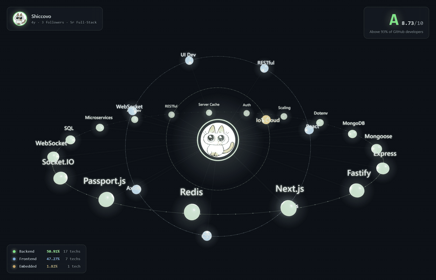

# Shiccovo

**Sr Full-Stack Developer** · 4 years on GitHub

#### Drag · scroll · hover &nbsp;→&nbsp; [Open interactive demo](https://shiccovo.github.io/Shiccovo/)

---

#### Backend &nbsp;·&nbsp; 50.91%

`MongoDB` `Mongoose` `Express` `Fastify` `Next.js` `Redis` `Passport.js` `Socket.IO` `WebSocket` `SQL` `Microservices` `API Development` `RESTful` `Server Caching` `Auth` `Scaling` `Dotenv`

#### Frontend &nbsp;·&nbsp; 47.27%

`React` `Next.js` `CSS Styling` `Axios` `WebSocket` `UI Development` `RESTful`

#### Embedded &nbsp;·&nbsp; 1.82%

`IoT Cloud Platforms`

---

Built with Three.js — no external runtime, single-file HTML, ~25 KB minified.

